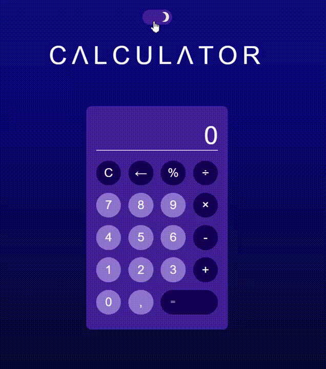

<h1 align='center'>CΛLCULΛTOR</h1>
<h2 align='center'>Приложение написанное на React</h2> 

  

<h2>Используемые технологии:</h2>

 

## Начало работы
### Склонируйте репозиторий к себе на устройство с помощью команды в терминале
* `git clone (адрес репозитория)`;
### Подтяните зависимости для корректной работы приложения
* `npm ci или npm i`
### Для сборки проекта в папке public 
* `npm run build`
### Для запуска проекта 
* `npm run start`

<h2>Планы по доработке проекта:</h2>
<ul>
  <li>Добавить возможность ввода значений при помощи клавиатуры.</li>
  <li>Улучшить чистоту кода.</li>
  <li>Расширить функционал калькулятора (возведение в степень, квадратный корень и др.)</li>
  <li>Улучшить UI UX проекта, путем добавления новых эффектов и анимаций и переработки уже имеющихся компонентов</li>
  <li>Добавить адаптивность странице</li>
</ul>

<h2>Результаты проекта:</h2>
<ul>
  <li>Выполнил самостоятельный проект с использованием открытых источников.</li>
  <li>Улучшил свои навыки владения версткой, JS, React, React Context</li>
</ul>
